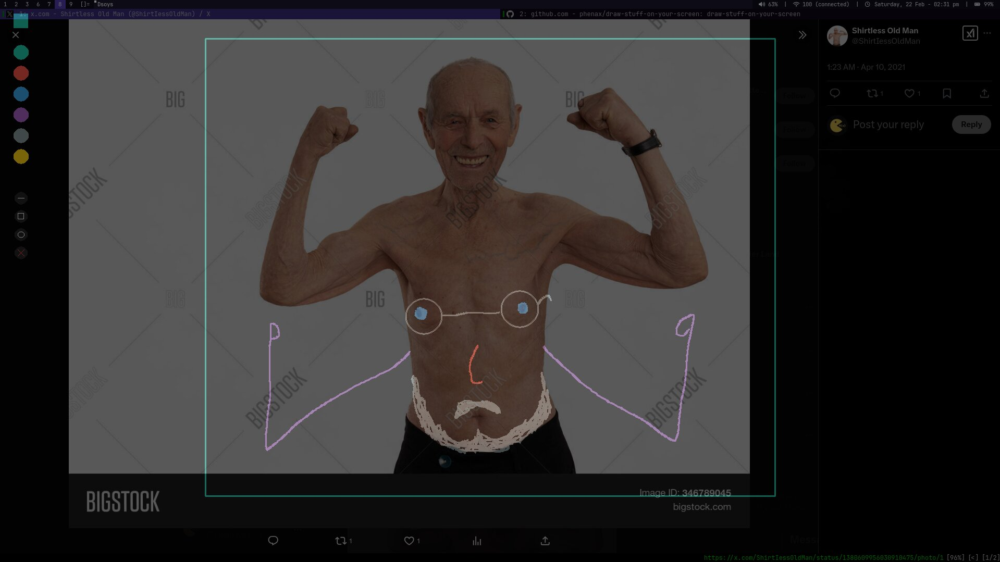

# dsoys
Draw stuff on your screen



## Installation
- Clone the repo
- Build with crystal or nix
```sh
crystal build src/main.cr
# OR
nix build
```

Or run it directly with nix
```
nix run github:phenax/chelleport#chelleport
```

## Usage
Run `dsoys` and draw stuff

#### Keybindings
- `q`: Quit
- `r`: Rectangle tool
- `p`: Pencil tool
- `c`: Circle tool
- `d`: Delete object tool
- `1-6`: Select the colors
- `Delete`: Clear screen
- `Tab`: Toggle ui elements
